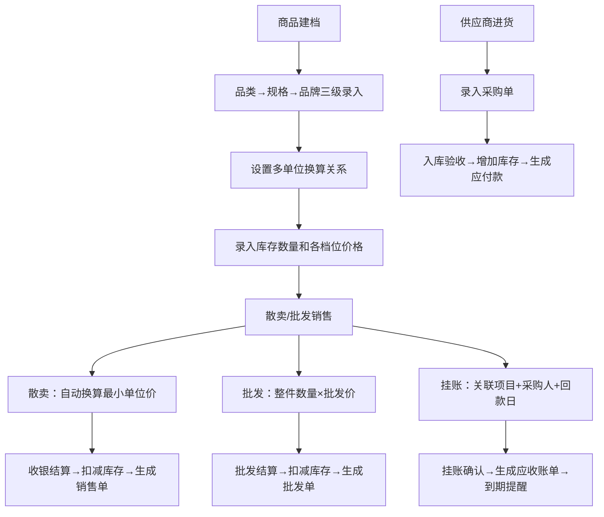
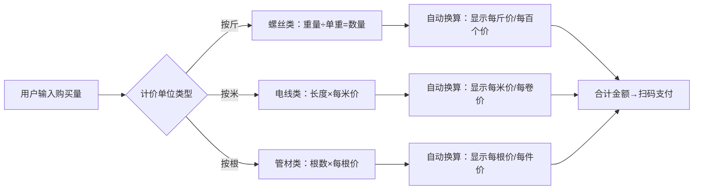

## 1. 产品概述

五金建材店管理系统，解决传统建材店库存混乱、计价繁琐、账目不清的痛点。面向建材店老板、收银员、库管员，实现商品全生命周期管理、灵活计价、多模式销售、客户账期管理和供应商进货追溯。

## 2. 核心功能

### 2.1 用户角色
| 角色 | 注册方式 | 核心权限 |
|------|---------|---------|
| 店长 | 系统初始化创建 | 全部权限：商品管理、销售、采购、报表、系统设置 |
| 收银员 | 店长创建 | 散卖收银、批发开单、挂账查询 |
| 库管员 | 店长创建 | 库存管理、进货录单、盘点、出入库 |

### 2.2 功能模块
1. **仪表盘**：销售概览、库存预警、今日流水、应收款提醒
2. **商品库存**：品类-规格-品牌三级管理、库存盘点、预警设置
3. **散卖收银**：称重/按米/按根计价、最小单位自动换算、实时比价
4. **整件批发**：批量销售、折扣管理、批发单打印
5. **工程挂账**：项目管理、采购人信息、约定回款日、应收账单
6. **供应商管理**：供应商信息、进货录单、采购台账、付款记录
7. **数据报表**：销售报表、库存报表、应收应付报表

### 2.3 页面详情
| 页面名称 | 模块名称 | 功能描述 |
|---------|---------|----------|
| 仪表盘 | 数据概览 | 今日销售额、销售笔数、库存预警商品、临近回款项目、快捷操作入口 |
| 商品管理 | 分类树 | 品类层级展示（螺丝/工具/管材/电线/开关/涂料/防水）、规格管理、品牌管理 |
| 商品管理 | 商品列表 | SKU列表、库存数量、最小单位价、批发价、零售价、条码管理 |
| 散卖收银 | 收银台 | 扫码/搜索添加商品、称重输入、自动换算单价、实时合计、多种支付方式 |
| 整件批发 | 批发开单 | 客户选择、商品批量录入、整件数量、折扣计算、打印出库单 |
| 工程挂账 | 项目管理 | 项目信息、采购人、地址、约定回款日、挂账总额、已还金额 |
| 工程挂账 | 应收账单 | 账单列表、回款记录、逾期提醒、批量导出 |
| 供应商管理 | 供应商列表 | 联系人、电话、地址、主营品类、信誉评级 |
| 供应商管理 | 进货录单 | 采购商品、数量、单价、金额、付款方式、入库状态 |
| 库存盘点 | 盘点单 | 账面库存、实际库存、盘盈盘亏、差异原因、审核确认 |

## 3. 核心流程

散卖计价换算流程：

## 4. 用户界面设计

### 4.1 设计风格
- **主色调**：深蓝色 #1e3a8a（专业、可靠），搭配工业橙 #f97316（活力、警示）
- **辅助色**：锌灰系列（zinc-50 到 zinc-900）用于中性界面
- **按钮风格**：直角硬朗风格，4px圆角，hover时有轻微上浮和阴影增强
- **字体**：标题使用"Noto Sans SC Bold"，正文使用"Noto Sans SC Regular"，数据展示使用等宽字体"JetBrains Mono"
- **布局风格**：左侧垂直导航+顶部工具栏+主内容区卡片式布局
- **图标**：Lucide图标库，统一使用线性图标，尺寸16px/20px
- **工业感**：表格使用细线边框，数据区使用浅灰斑马纹，关键数据高亮显示

### 4.2 页面设计概述
| 页面名称 | 模块名称 | UI元素 |
|---------|---------|--------|
| 仪表盘 | 数据卡片 | 6个核心指标卡片网格，蓝色渐变背景，大号数字，增长箭头动效 |
| 仪表盘 | 快捷入口 | 彩色图标+文字的8宫格，hover时缩放1.05倍 |
| 商品管理 | 分类树 | 左侧可折叠树形结构，三级缩进，选中项高亮蓝色背景 |
| 商品管理 | 商品列表 | 右侧数据表格，支持筛选、搜索、分页，库存预警行标红 |
| 散卖收银 | 左侧商品区 | 分类标签页+商品网格卡片，点击添加到购物车 |
| 散卖收银 | 右侧购物车 | 商品列表、数量/重量输入框、单位换算显示、合计区固定底部 |
| 工程挂账 | 项目卡片 | 卡片式布局，显示项目名称、采购人、回款倒计时、挂账金额进度条 |
| 进货录单 | 表单区 | 分步表单，供应商选择→商品明细→金额汇总→确认入库 |

### 4.3 响应式
- **桌面优先**：1920px设计基准，主要针对收银台和管理电脑
- **平板适配**：1024px断点，导航折叠为汉堡菜单，表格支持横向滚动
- **移动端**：640px断点，卡片垂直堆叠，关键操作按钮固定底部
- **触控优化**：按钮最小高度44px，输入框有足够触控区域

### 4.4 交互动效
- 页面加载：主体内容淡入（opacity 0→1，300ms）
- 列表项：hover时背景色过渡（150ms），左侧边框高亮
- 收银台商品添加：飞入购物车动画（translate+scale）
- 数据更新：数字变化时滚动动效（0→目标值，500ms）
- 模态框：缩放出现（scale 0.9→1，200ms），背景半透明遮罩
