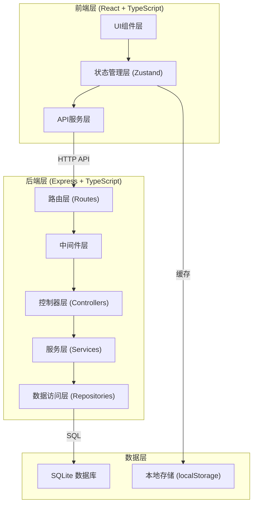
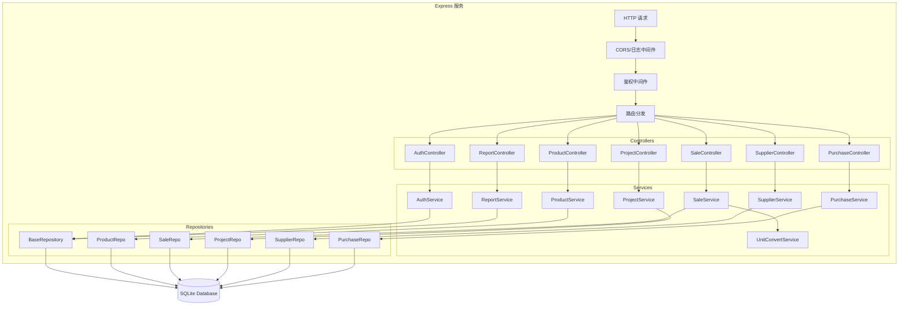
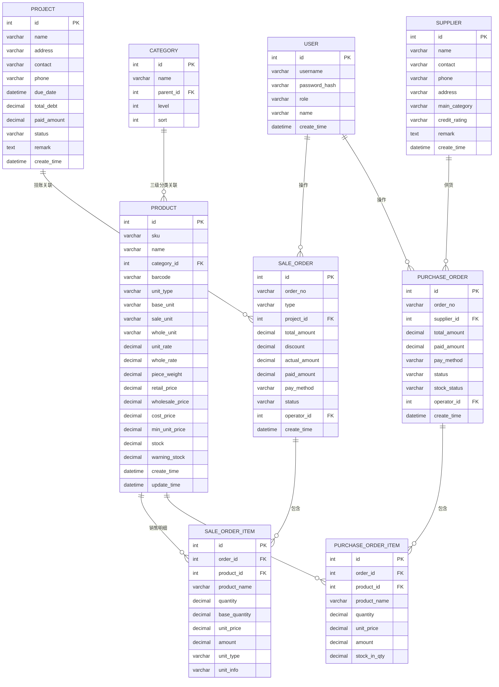

## 1. 架构设计



## 2. 技术描述

- **前端**：React@18 + TypeScript + Vite@5 + TailwindCSS@3 + Zustand@4 + React Router@6 + Lucide React@0.344
- **后端**：Express@4 + TypeScript + better-sqlite3（轻量级嵌入式数据库）
- **数据库**：SQLite（单文件，无需单独部署，适合单机/小团队使用）
- **初始化工具**：vite-init（react-express-ts模板）
- **状态管理**：Zustand（轻量级，无需Provider，API简洁）
- **HTTP客户端**：axios
- **日期处理**：date-fns
- **UI组件库**：基于TailwindCSS自定义组件，部分使用shadcn/ui模式

**技术选型理由**：
1. SQLite无需单独安装数据库服务，部署简单，适合五金店这种小型管理系统
2. React+TypeScript保证类型安全，减少运行时错误
3. Zustand比Redux更轻量，学习成本低
4. TailwindCSS快速构建工业风格界面

## 3. 路由定义

| 路由路径 | 页面名称 | 权限要求 |
|---------|---------|---------|
| / | 仪表盘 | 所有角色 |
| /login | 登录页 | 公开 |
| /products | 商品管理 | 店长/库管员 |
| /products/category | 品类管理 | 店长 |
| /cashier | 散卖收银 | 店长/收银员 |
| /wholesale | 整件批发 | 店长/收银员 |
| /projects | 工程挂账 | 店长/收银员 |
| /projects/:id | 项目详情 | 店长/收银员 |
| /suppliers | 供应商管理 | 店长/库管员 |
| /purchase | 进货录单 | 店长/库管员 |
| /inventory | 库存盘点 | 店长/库管员 |
| /reports | 数据报表 | 店长 |
| /settings | 系统设置 | 店长 |

## 4. API 定义

### 4.1 TypeScript 类型定义

```typescript
// 共享类型定义 (shared/types.ts)

// 品类三级结构
interface Category {
  id: number;
  name: string;           // 一级品类：螺丝/工具/管材/电线/开关/涂料/防水
  parentId: number | null;
  level: 1 | 2 | 3;       // 1=品类, 2=规格, 3=品牌
  sort: number;
}

// 商品SKU
interface Product {
  id: number;
  sku: string;
  name: string;
  categoryId: number;     // 关联三级分类（品牌级）
  specId: number;         // 规格ID
  brandId: number;        // 品牌ID
  barcode: string;        // 条码
  unitType: 'piece' | 'weight' | 'length';  // 计价单位：个/斤/米
  baseUnit: string;       // 最小单位：个/克/毫米
  saleUnit: string;       // 销售单位：个/斤/米/根
  wholeUnit: string;      // 整件单位：箱/包/卷
  unitRate: number;       // 销售单位→最小单位换算率
  wholeRate: number;      // 整件→销售单位换算率
  pieceWeight: number;    // 单重（克，用于螺丝按斤卖）
  retailPrice: number;    // 零售价（销售单位）
  wholesalePrice: number; // 批发价（销售单位）
  costPrice: number;      // 成本价
  minUnitPrice: number;   // 最小单位价（自动计算，用于比价）
  stock: number;          // 库存数量（最小单位）
  warningStock: number;   // 预警库存
  createTime: number;
  updateTime: number;
}

// 工程客户
interface Project {
  id: number;
  name: string;           // 项目名称
  address: string;
  contact: string;        // 采购人
  phone: string;
  dueDate: number;        // 约定回款日（时间戳）
  totalDebt: number;      // 挂账总额
  paidAmount: number;     // 已还金额
  status: 'active' | 'completed' | 'overdue';
  remark: string;
  createTime: number;
}

// 供应商
interface Supplier {
  id: number;
  name: string;
  contact: string;
  phone: string;
  address: string;
  mainCategory: string;   // 主营品类
  creditRating: 'A' | 'B' | 'C';
  remark: string;
  createTime: number;
}

// 销售单
interface SaleOrder {
  id: number;
  orderNo: string;
  type: 'retail' | 'wholesale' | 'credit';
  customerId?: number;
  projectId?: number;     // 挂账关联项目
  items: SaleOrderItem[];
  totalAmount: number;
  discount: number;
  actualAmount: number;
  paidAmount: number;
  payMethod: 'cash' | 'wechat' | 'alipay' | 'card' | 'credit';
  status: 'pending' | 'paid' | 'partial' | 'void';
  operatorId: number;
  createTime: number;
}

interface SaleOrderItem {
  id: number;
  orderId: number;
  productId: number;
  productName: string;
  quantity: number;       // 销售数量（销售单位）
  baseQuantity: number;   // 最小单位数量（用于扣库存）
  unitPrice: number;      // 销售单价
  amount: number;
  unitType: 'piece' | 'weight' | 'length';
  unitInfo: string;       // 显示用：如"2.5斤=1250个"
}

// 采购单
interface PurchaseOrder {
  id: number;
  orderNo: string;
  supplierId: number;
  items: PurchaseOrderItem[];
  totalAmount: number;
  paidAmount: number;
  payMethod: 'cash' | 'transfer' | 'credit';
  status: 'pending' | 'partial' | 'paid';
  stockStatus: 'pending' | 'partial' | 'completed';
  operatorId: number;
  createTime: number;
}

interface PurchaseOrderItem {
  id: number;
  orderId: number;
  productId: number;
  productName: string;
  quantity: number;
  unitPrice: number;
  amount: number;
  stockInQty: number;     // 已入库数量
}
```

### 4.2 API 接口列表

| 方法 | 路径 | 说明 |
|-----|------|------|
| POST | /api/auth/login | 登录 |
| GET | /api/categories | 获取品类树 |
| POST | /api/categories | 新增品类 |
| PUT | /api/categories/:id | 更新品类 |
| DELETE | /api/categories/:id | 删除品类 |
| GET | /api/products | 商品列表（分页+筛选） |
| GET | /api/products/:id | 商品详情 |
| POST | /api/products | 新增商品 |
| PUT | /api/products/:id | 更新商品 |
| DELETE | /api/products/:id | 删除商品 |
| GET | /api/products/barcode/:barcode | 条码查询商品 |
| POST | /api/sale/retail | 散卖收银结算 |
| POST | /api/sale/wholesale | 批发开单 |
| POST | /api/sale/credit | 工程挂账 |
| GET | /api/sale/orders | 销售单列表 |
| GET | /api/sale/orders/:id | 销售单详情 |
| GET | /api/projects | 项目列表 |
| GET | /api/projects/:id | 项目详情（含账单） |
| POST | /api/projects | 新增项目 |
| POST | /api/projects/:id/payment | 项目回款 |
| GET | /api/suppliers | 供应商列表 |
| POST | /api/suppliers | 新增供应商 |
| GET | /api/purchase | 采购单列表 |
| POST | /api/purchase | 创建采购单 |
| POST | /api/purchase/:id/stock-in | 采购入库 |
| POST | /api/purchase/:id/payment | 采购付款 |
| GET | /api/reports/sales | 销售报表 |
| GET | /api/reports/inventory | 库存报表 |
| GET | /api/reports/receivable | 应收报表 |
| GET | /api/dashboard/stats | 仪表盘数据 |

## 5. 服务端架构图



## 6. 数据模型

### 6.1 ER 图



### 6.2 DDL 语句

```sql
-- 品类表
CREATE TABLE categories (
    id INTEGER PRIMARY KEY AUTOINCREMENT,
    name VARCHAR(50) NOT NULL,
    parent_id INTEGER,
    level INTEGER NOT NULL CHECK (level IN (1,2,3)),
    sort INTEGER DEFAULT 0,
    FOREIGN KEY (parent_id) REFERENCES categories(id)
);

-- 商品表
CREATE TABLE products (
    id INTEGER PRIMARY KEY AUTOINCREMENT,
    sku VARCHAR(50) UNIQUE NOT NULL,
    name VARCHAR(100) NOT NULL,
    category_id INTEGER NOT NULL,
    barcode VARCHAR(50),
    unit_type VARCHAR(10) NOT NULL CHECK (unit_type IN ('piece','weight','length')),
    base_unit VARCHAR(10) NOT NULL,
    sale_unit VARCHAR(10) NOT NULL,
    whole_unit VARCHAR(10),
    unit_rate DECIMAL(10,2) NOT NULL DEFAULT 1,
    whole_rate DECIMAL(10,2),
    piece_weight DECIMAL(10,2),
    retail_price DECIMAL(10,2) NOT NULL,
    wholesale_price DECIMAL(10,2) NOT NULL,
    cost_price DECIMAL(10,2) NOT NULL,
    min_unit_price DECIMAL(10,4) NOT NULL,
    stock DECIMAL(10,2) NOT NULL DEFAULT 0,
    warning_stock DECIMAL(10,2) DEFAULT 10,
    create_time DATETIME DEFAULT CURRENT_TIMESTAMP,
    update_time DATETIME DEFAULT CURRENT_TIMESTAMP,
    FOREIGN KEY (category_id) REFERENCES categories(id)
);
CREATE INDEX idx_products_barcode ON products(barcode);
CREATE INDEX idx_products_category ON products(category_id);
CREATE INDEX idx_products_stock ON products(stock);

-- 项目表
CREATE TABLE projects (
    id INTEGER PRIMARY KEY AUTOINCREMENT,
    name VARCHAR(100) NOT NULL,
    address VARCHAR(200),
    contact VARCHAR(50) NOT NULL,
    phone VARCHAR(20) NOT NULL,
    due_date DATETIME NOT NULL,
    total_debt DECIMAL(10,2) DEFAULT 0,
    paid_amount DECIMAL(10,2) DEFAULT 0,
    status VARCHAR(20) DEFAULT 'active',
    remark TEXT,
    create_time DATETIME DEFAULT CURRENT_TIMESTAMP
);
CREATE INDEX idx_projects_status ON projects(status);
CREATE INDEX idx_projects_due_date ON projects(due_date);

-- 供应商表
CREATE TABLE suppliers (
    id INTEGER PRIMARY KEY AUTOINCREMENT,
    name VARCHAR(100) NOT NULL,
    contact VARCHAR(50),
    phone VARCHAR(20),
    address VARCHAR(200),
    main_category VARCHAR(50),
    credit_rating VARCHAR(5) DEFAULT 'B',
    remark TEXT,
    create_time DATETIME DEFAULT CURRENT_TIMESTAMP
);

-- 销售单表
CREATE TABLE sale_orders (
    id INTEGER PRIMARY KEY AUTOINCREMENT,
    order_no VARCHAR(30) UNIQUE NOT NULL,
    type VARCHAR(15) NOT NULL CHECK (type IN ('retail','wholesale','credit')),
    project_id INTEGER,
    total_amount DECIMAL(10,2) NOT NULL,
    discount DECIMAL(10,2) DEFAULT 0,
    actual_amount DECIMAL(10,2) NOT NULL,
    paid_amount DECIMAL(10,2) DEFAULT 0,
    pay_method VARCHAR(15) NOT NULL,
    status VARCHAR(15) NOT NULL DEFAULT 'paid',
    operator_id INTEGER NOT NULL,
    create_time DATETIME DEFAULT CURRENT_TIMESTAMP,
    FOREIGN KEY (project_id) REFERENCES projects(id)
);
CREATE INDEX idx_sale_orders_type ON sale_orders(type);
CREATE INDEX idx_sale_orders_create_time ON sale_orders(create_time);
CREATE INDEX idx_sale_orders_project ON sale_orders(project_id);

-- 销售明细表
CREATE TABLE sale_order_items (
    id INTEGER PRIMARY KEY AUTOINCREMENT,
    order_id INTEGER NOT NULL,
    product_id INTEGER NOT NULL,
    product_name VARCHAR(100) NOT NULL,
    quantity DECIMAL(10,2) NOT NULL,
    base_quantity DECIMAL(10,2) NOT NULL,
    unit_price DECIMAL(10,2) NOT NULL,
    amount DECIMAL(10,2) NOT NULL,
    unit_type VARCHAR(10) NOT NULL,
    unit_info VARCHAR(50),
    FOREIGN KEY (order_id) REFERENCES sale_orders(id),
    FOREIGN KEY (product_id) REFERENCES products(id)
);

-- 采购单表
CREATE TABLE purchase_orders (
    id INTEGER PRIMARY KEY AUTOINCREMENT,
    order_no VARCHAR(30) UNIQUE NOT NULL,
    supplier_id INTEGER NOT NULL,
    total_amount DECIMAL(10,2) NOT NULL,
    paid_amount DECIMAL(10,2) DEFAULT 0,
    pay_method VARCHAR(15) DEFAULT 'credit',
    status VARCHAR(15) DEFAULT 'pending',
    stock_status VARCHAR(15) DEFAULT 'pending',
    operator_id INTEGER NOT NULL,
    create_time DATETIME DEFAULT CURRENT_TIMESTAMP,
    FOREIGN KEY (supplier_id) REFERENCES suppliers(id)
);
CREATE INDEX idx_purchase_orders_supplier ON purchase_orders(supplier_id);
CREATE INDEX idx_purchase_orders_create_time ON purchase_orders(create_time);

-- 采购明细表
CREATE TABLE purchase_order_items (
    id INTEGER PRIMARY KEY AUTOINCREMENT,
    order_id INTEGER NOT NULL,
    product_id INTEGER NOT NULL,
    product_name VARCHAR(100) NOT NULL,
    quantity DECIMAL(10,2) NOT NULL,
    unit_price DECIMAL(10,2) NOT NULL,
    amount DECIMAL(10,2) NOT NULL,
    stock_in_qty DECIMAL(10,2) DEFAULT 0,
    FOREIGN KEY (order_id) REFERENCES purchase_orders(id),
    FOREIGN KEY (product_id) REFERENCES products(id)
);

-- 用户表
CREATE TABLE users (
    id INTEGER PRIMARY KEY AUTOINCREMENT,
    username VARCHAR(30) UNIQUE NOT NULL,
    password_hash VARCHAR(100) NOT NULL,
    role VARCHAR(15) NOT NULL CHECK (role IN ('admin','cashier','stock')),
    name VARCHAR(50) NOT NULL,
    create_time DATETIME DEFAULT CURRENT_TIMESTAMP
);

-- 初始化数据：默认管理员
INSERT INTO users (username, password_hash, role, name) 
VALUES ('admin', 'admin123', 'admin', '系统管理员');

-- 初始化数据：一级品类
INSERT INTO categories (name, parent_id, level, sort) VALUES
('螺丝类', NULL, 1, 1),
('工具类', NULL, 1, 2),
('管材类', NULL, 1, 3),
('电线类', NULL, 1, 4),
('开关类', NULL, 1, 5),
('涂料类', NULL, 1, 6),
('防水类', NULL, 1, 7);
```
